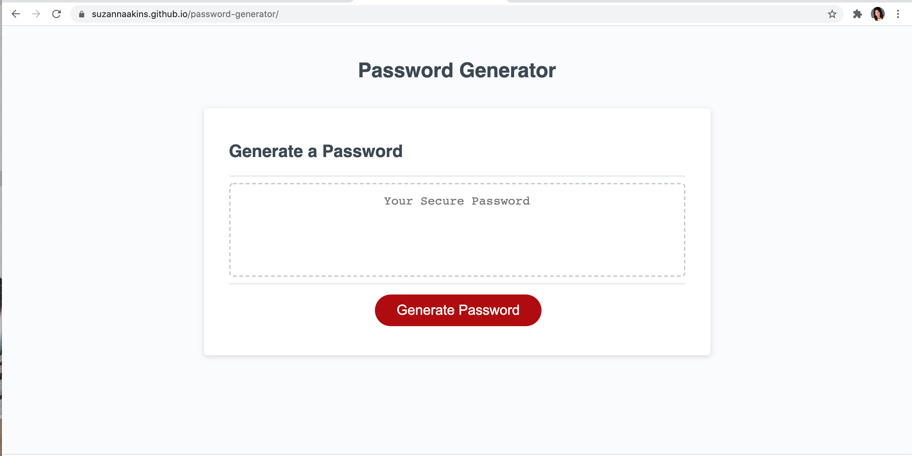
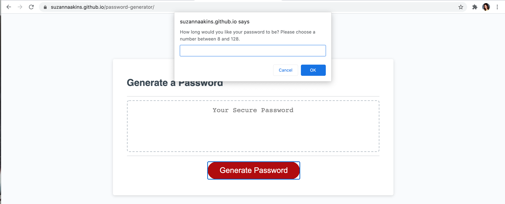
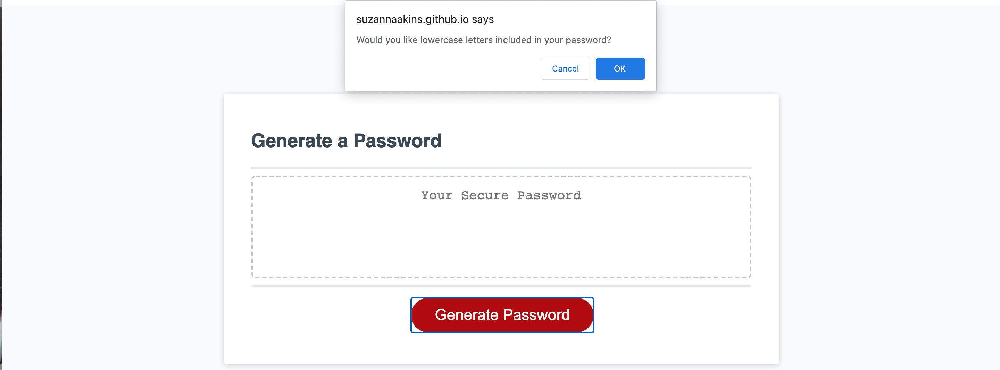
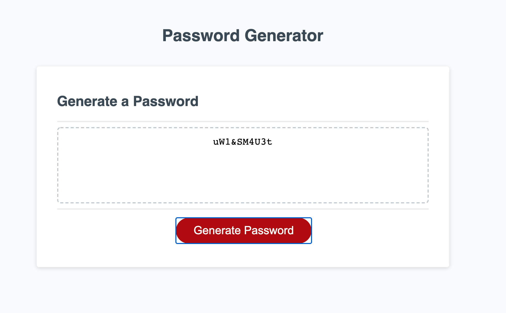

# password-generator

This is a website that gets your input as to what types of characters you want in your password, and then it creates a randomized password for you!

## Description

Using Javascript, I wrote a series of variables and functions to create a random password.

At the top are the four arrays for the four possible character types - lowercase letters, uppercase letters, numbers, and special characters. 

After that, I wrote a function that selects a random character from its array, in the case that the user would like to include characters from that specific array. I then wrote variables using that function, so that these variables could be called later if needed. 

After that, things really start to get exciting; the function to generate the password itself begins!  To begin, we prompt the user to see how long they'd like their password to be. They can choose anything between 8 and 128, and they must enter a number. If they don't enter correctly, the prompt will loop until a suitable answer is given.

Now, we ask the user which types of characters they'd like to include in their password. If they choose none of the four options, we alert them that they need to have at least one type of character. Then we ask them again which types they'd like. 

Next, I created two more arrays.  The first, guaranteed characters, is an array, containing between 1 and 4 items (depending how many different character types the user selects).  We fill the array based on the user's answers.  Whichever character types they want to include, I use my function from the top of the code which selected a random character from its array.  Then I add these randomly selected characters to the guaranteed characters array. 

As for the possible characters, we need to inclue the arrays of the character types they want. So, for the types they confirmed, we add one character from that array to the guaranteed characters, and then we also add the entire array to our possible characters array.  I used concat (concatonate) to avoid having an array inside of another array. 

Next, I set the variable password to equal the guaranteed characters array. Then I set the total length of the final password to be equal to the password length that they chose, minus the number of items in the guaranteed characters array (this is so that when the for loops starts, the computer doesn't add the number they chose amount of possible characters, because then the password will be too long once the guaranteed characters are also included).

After that, I have a for loop that randomly selects characters from the possible charactes array, and pushes them to the password variable array.  To turn this array into a string, I created another for loop that adds the items in the array to return a final password. 

The event listener runs the function when the "Generate" button is clicked, and voila! You're all set, with your customized, random password.  Let's get super secure!

## Challenges

This was my second time coding in Javascript, so it was a bit challenging getting the hang of the correct syntax.  I still struggle to know exactly when I only need a variable, and when I need a function.  

The other big challenge was figuring out how to make sure the user enters a NUMBER when prompted for the password length.  I spent hours trying all kinds of things, like NaN, is NOT equal to statements, etc. The result ended up being isNan(passwordLength).  Javascript is very particular, I learned. 

## Check it Out

Test it out yourself!

Here is a preview of the page:  

Here's the prompt for the length: 

A character type prompt: 

And the resulting, randomized password!  I chose to include all four character types. 

And, you may view the page here: https://suzannaakins.github.io/password-generator/

Thank you for reading :blush:
